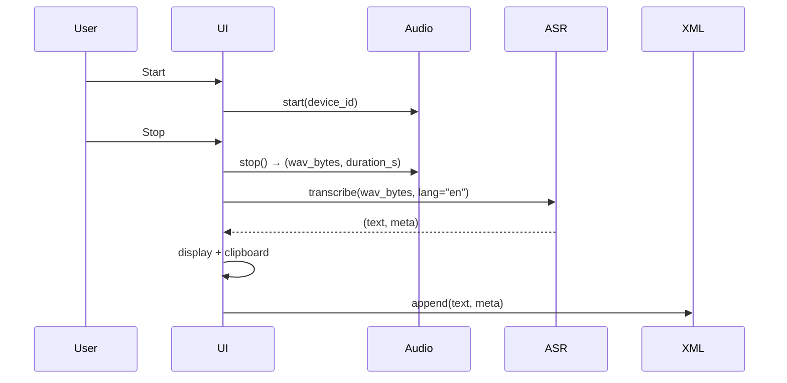

ChatterBug

Design and Development of a Linux-First Local Transcription Utility  
Author: Andrew Brown  
Date: 2025-09-17  
Version: Draft v2.1 (MVP refined)

---

## Abstract
ChatterBug is a single-user, Python-based desktop utility for offline speech-to-text on Linux. It prioritizes accuracy and simplicity over cloud features. The MVP uses Voxtral as the primary ASR backend with Faster-Whisper as a fallback. The app presents a minimal UI (Start/Stop + transcript area), copies results to the clipboard, and appends each result to a local XML log. No encryption, summarization, or multi-user features are included in the MVP.

---

## 1. Introduction

### 1.1 Purpose
This paper presents the design of ChatterBug, a local speech-to-text (STT) utility built entirely in Python. Earlier ideas involving Java, gRPC, and Spring Boot are discarded; this is a fresh baseline (Draft v2.1). The project is intentionally narrow: an offline transcription tool with a minimal UI, reliable performance, and a clean modular design. Its purpose is twofold:
- Deliver a functional MVP useful for day-to-day transcription.
- Serve as a learning exercise in building complete applications solo, using Python and standard tooling.

### 1.2 Problem Statement
Users need a fast, offline way to dictate short notes and immediately paste the transcript into other applications. Existing tools often require cloud connectivity, subscriptions, or heavyweight software stacks. ChatterBug focuses on a Linux desktop workflow: speak, stop, paste.

### 1.3 Product Overview (MVP)
- Run: `python3 main.py`
- UI: One window with transcript area and Start/Stop button.
- Capture → Transcribe: Press Start, speak, press Stop.
- Output: Transcript appears in the window, copied to clipboard, and logged to local XML.
- ASR: Voxtral (primary), Faster-Whisper (fallback).
- Hardware: Designed for systems with NVIDIA GPUs (CUDA), though CPU fallback is possible.
- Platform: Linux (Ubuntu/Pop!_OS baseline).

### 1.4 Principles
- Local-only: No network calls in the core flow.
- GPU-aware: Optimize for NVIDIA GPU acceleration when available.
- Small surface area: Few dependencies, tight modules.
- Single responsibility: UI, audio, ASR, storage remain separate.
- Accuracy over streaming: Process after speech, not token-by-token.

### 1.5 Out of Scope (for MVP)
- Encryption at rest, summarization, embeddings/search.
- Diarization, plugins, team/sync, mobile apps, cloud services.

### 1.6 Success Criteria (MVP)
- Stop→text visible ≤8 s on CUDA (≤12 s CPU). 
- Clipboard contains the final transcript after each Stop.
- XML log gains one `<t at="ISO8601">…</t>` entry per Stop.
- App runs offline and does not crash during a 10-minute session.
- Cold start model load accounted for in performance testing.

---

## 2. Goals and Non-Goals

### 2.1 Goals
ChatterBug v2.1 aims to deliver a **Modular Local Transcription Framework** focused on:
- Core Workflow: Capture speech, transcribe locally, display in a window, copy to clipboard, and log to XML.
- GPU Acceleration: Optimize for NVIDIA CUDA GPUs to ensure low-latency transcription on supported hardware.
- Linux Desktop Support: Target Ubuntu/Pop!_OS as the reference platforms.
- Modularity: Maintain clear boundaries between UI, audio capture, ASR, and storage components.
- Simplicity: Provide a single-user, offline-only flow that is fast to run and easy to use.
- Safety: Enforce a configurable max recording duration to prevent runaway captures.

### 2.2 Non-Goals (for MVP)
The following are explicitly out of scope for the MVP:
- Encryption at rest or in transit.
- Summarization, embeddings, or advanced natural-language processing.
- Diarization or speaker attribution.
- Multi-user features, cloud sync, or mobile apps.
- Plugin frameworks or extensibility layers.
- Polished UI design and packaging (planned for future versions, not MVP).

---

## 3. Architecture Overview

### 3.1 System Context
Python-only, single process. Linux first (Ubuntu/Pop!_OS). NVIDIA CUDA preferred. Offline.

```mermaid
flowchart LR
  UI[UI (Tkinter)] -->|Start/Stop| CAP[Audio Capture]
  CAP -->|WAV bytes| ASR[ASR Engine<br/>Voxtral → FW fallback]
  ASR -->|text + meta| UI
  ASR -->|text + meta| STORE[Storage (XML)]
  UI -->|copy| CLIP[Clipboard]
```

### 3.2 Modules and Responsibilities
- **UI (`ui.py`)**: window, Start/Stop, transcript view, clipboard, device dropdown, background threads.
- **Audio (`audio.py`)**: record 16 kHz mono PCM from selected device, return WAV bytes and duration.
- **ASR (`asr.py`)**: Voxtral small INT8 on CUDA if present; fallback to Faster-Whisper base INT8; returns text + metadata.
- **Storage (`storage.py`)**: ensure `~/.chatterbug/transcripts.xml`, append entries, crash-safe write.

### 3.3 Data Flow (Happy Path)


### 3.4 Concurrency Model
- Tkinter mainloop on UI thread.
- Recording thread drains audio queue.
- ASR thread runs model inference.
- UI updates via `root.after(...)`.

### 3.5 Error Handling and Fallbacks
- Voxtral init failure → switch to Faster-Whisper; show non-blocking banner.
- Both fail → disable Start; persistent banner.
- No audio device → disable Start; show guidance.
- Audio disconnect mid-record → auto-stop with error message.
- Storage error → keep UI + clipboard; toast the write error.
- GPU OOM → release model, retry fallback engine.

### 3.6 Configuration (MVP Defaults)
- Language: en fixed.
- Model: Voxtral small INT8 (primary).
- Fallback: Faster-Whisper base INT8.
- GPU: CUDA used if available; CPU fallback allowed.
- Audio device: dropdown selects input device, with Refresh button.
- Paths: XML at `~/.chatterbug/transcripts.xml`.

### 3.7 External Dependencies
`tkinter` (stdlib), `sounddevice`, `soundfile`, `numpy`, `voxtral` runtime, `faster-whisper`, `psutil` (optional).

### 3.8 Interfaces (Sketch)
```python
# audio.py
class Recorder:
    def list_input_devices() -> list[dict]: ...
    def start(device_id: int | None = None) -> None: ...
    def stop_get_wav() -> tuple[bytes, float]: ...

# asr.py
def transcribe_wav(wav_bytes: bytes, lang: str = "en") -> tuple[str, dict]:
    """returns (text, meta) where meta includes engine, model, lang, dur_s, rtf, load_ms, mem_mb"""

# storage.py
def append_xml(text: str, meta: dict, when: datetime) -> None: ...
```

### 3.9 XML Schema (MVP)
```xml
<transcripts>
  <t at="2025-09-17T19:40:12Z"
     engine="voxtral"
     model="voxtral-small-int8"
     lang="en"
     dur_s="8.42"
     load_ms="3200"
     mem_mb="850">
    Dictated text goes here.
  </t>
</transcripts>
```

---

## 4. Detailed Requirements

### 4.1 Functional
- Start/Stop recording from selected input device.
- Show final transcript in UI after Stop.
- Auto-copy transcript to clipboard with status line confirmation.
- Append transcript entry to XML with metadata.
- Persist last-used settings (audio device, model) to `~/.chatterbug/config.json`.
- Enforce a max recording duration (default 60 s, configurable).

### 4.2 Non-Functional
- Latency: Stop→text ≤8 s CUDA; ≤12 s CPU, including cold start.
- Reliability: No crash in a 10-minute session (≥5 cycles).
- Resource caps: ≤1.5 GB RSS during inference.
- Startup: UI ≤1 s.
- Integration test validates full pipeline with known audio.

### 4.3 UI (Tkinter)
- Transcript area scrollable, read-only.
- Start/Stop toggle button.
- Input device dropdown with Refresh.
- Status line: Idle, Recording, Processing, Done, errors.
- Progress indicator during Processing.
- Keyboard: Enter = toggle; Esc = cancel.
- Clipboard auto-copy with confirmation.

### 4.4 Audio
- 16 kHz, mono, PCM16.
- Default = system device; dropdown switchable.
- Disconnection mid-record → auto-stop with banner.
- Queue-driven capture; drop frames if lag.
- Duration computed from frames.

### 4.5 ASR
- Voxtral small INT8 primary (CUDA if present).
- Faster-Whisper base INT8 fallback.
- Both fail → disable Start; banner.
- Language = en.
- Meta includes duration, realtime factor, load time, GPU mem.

### 4.6 Storage
- `~/.chatterbug/transcripts.xml`.
- Atomic write with temp replace.
- On startup, validate XML; backup and reset if corrupt.
- Schema includes attrs for engine, model, lang, dur_s, rtf, load_ms, mem_mb.

---

## 5. Implementation Plan

### 5.1 Overview
Five sequential iterations, each with acceptance tests.

### 5.2 Iteration 1 — UI Scaffold
Goal: Tkinter window with controls.  
Acceptance: UI visible in ≤1 s, no errors.  
Commit: `feat(ui): initial window and controls`

### 5.3 Iteration 2 — Audio Capture
Goal: Capture WAV from selected device.  
Acceptance: WAV bytes valid, duration >0, UI responsive.  
Commit: `feat(audio): capture 16k mono WAV from selected device`

### 5.4 Iteration 3 — ASR Integration
Goal: Transcribe audio to text.  
Acceptance: Short utterance transcribed ≤8 s CUDA (≤12 s CPU), fallback if needed.  
Commit: `feat(asr): voxtral small int8 with fw fallback`

### 5.5 Iteration 4 — Output & Clipboard
Goal: Display transcript and copy to clipboard.  
Acceptance: Text shown, paste works, status confirms copy, progress bar visible.  
Commit: `feat(output): transcript display and clipboard`

### 5.6 Iteration 5 — Storage & Config
Goal: XML logging and persisted config.  
Acceptance: XML grows by one valid entry each Stop; config reloads on restart.  
Commit: `feat(storage): xml log and config persistence`

### 5.7 Definition of Done
- All iterations pass tests.
- SLA met.
- Stable ≥10 min session.
- No network calls.

### 5.8 Risks and Spikes
- Voxtral/CUDA mismatches.
- Wayland audio quirks.
- Latency regressions.
- GPU OOM fallback.

---

## 6. Testing & Validation

### 6.1 Acceptance Tests
- Launch UI ≤1 s.
- Record 5–10 s utterance → Stop → transcript visible ≤8 s CUDA (≤12 s CPU).
- Clipboard contains transcript, status line says Copied.
- XML grows with valid entry.
- Restart → device/model restored.
- Max duration triggers auto-stop + warning.

### 6.2 Unit Tests
- XML append valid and atomic.
- Audio duration correct.
- Config load/save round-trip.
- XML corruption recovery works.

### 6.3 Integration & Performance
- End-to-end test with fixed WAV sample.
- Log latency including load time.
- Monitor memory (GPU/CPU).

### 6.4 Error Cases
- Voxtral fail → fallback.
- Both fail → Start disabled.
- Audio disconnect → auto-stop.
- Storage unwritable → clipboard still valid.

### 6.5 Logging
- Fields: device, engine, model, dur, rtf, load_ms, mem_mb.
- Rotating logs.

---

## 7. Implementation Details

### 7.1 Runtime
Python 3.11+. Linux-first. CUDA 12.x with NVIDIA Turing+.

### 7.2 Dependencies
Tkinter, sounddevice, soundfile, numpy, voxtral, faster-whisper, pytest, psutil.

### 7.3 Paths
- Transcripts: ~/.chatterbug/transcripts.xml
- Config: ~/.chatterbug/config.json
- Logs: ~/.chatterbug/chatterbug.log
- Caches: ~/.cache/voxtral

### 7.4 Error Handling
- XML corruption → backup + recreate.
- Audio disconnect → auto-stop.
- GPU OOM → free, fallback.

### 7.5 Installation
- Requires CUDA toolkit 12.x + NVIDIA drivers.
- System packages: portaudio19-dev, libsndfile1, build-essential.
- Repo clone, venv, pip install with CUDA wheels.

### 7.6 Logging
Rotating log, INFO default, DEBUG optional. Include perf metrics.

---

## 8. Conclusion

ChatterBug v2.1 is a **Modular Local Transcription Framework**: a minimal, offline tool for converting speech to text on Linux with NVIDIA GPU acceleration. Complexity has been cut back to Python-only with four clear modules: UI, Audio, ASR, and Storage.

The MVP scope is precise and improved:
- GPU latency expectations adjusted conservatively.
- Safety features added (max recording duration, XML validation).
- UX improved with progress indicator and clipboard confirmation.
- Error handling extended to device disconnects, GPU OOM, and ASR total failure.

Testing now includes an integration pipeline and explicit performance logging. Risks around Voxtral stability, CUDA versions, and Wayland are documented with fallback paths.

This refined MVP remains achievable, stable, and extensible. It sets a solid foundation for future polish, advanced features, and broader adoption once validated in real use.

